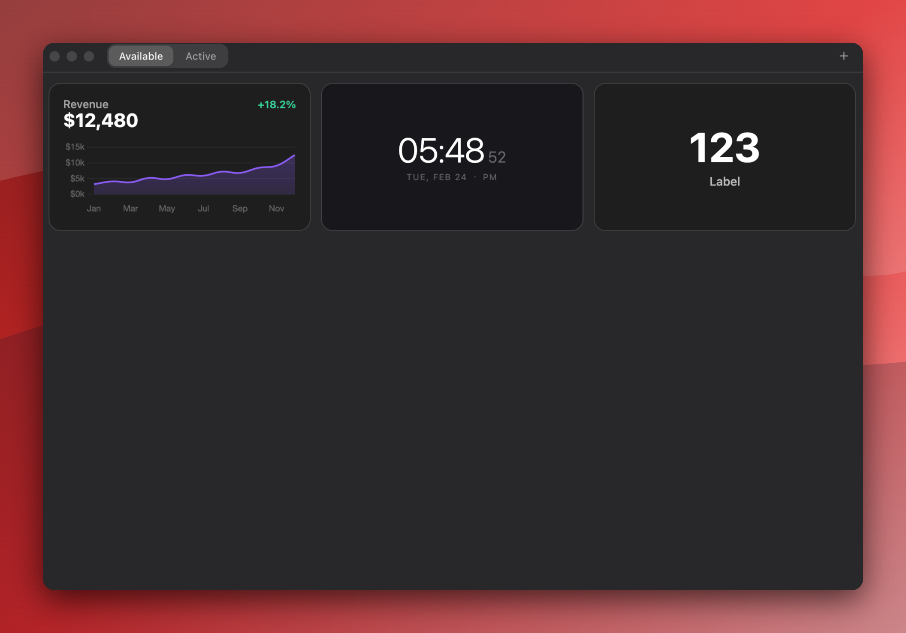

<p align="center">
  
</p>

<h1 align="center">Wigify</h1>

<p align="center">
  A desktop app that lets you create and display custom HTML/CSS/JS widgets right on your desktop.
</p>

<p align="center">
  <a href="https://github.com/wigify/wigify/releases">Download</a> · <a href="#features">Features</a> · <a href="#contributing">Contributing</a> · <a href="#license">License</a>
</p>

---

## Screenshots

<p align="center">
  
</p>

## Features

- **Custom HTML Widgets** - Write widgets using plain HTML, CSS, and JavaScript. No framework required.
- **Built-in Code Editor** - Full-featured Monaco editor with syntax highlighting, autocompletion, and live preview.
- **Live Preview** - See your changes in real-time as you edit widget code.
- **Widget Templates** - Get started quickly with built-in templates: Stat, Weather, Chart, Visualizer, Countdown, Digital Clock, and more.
- **Configurable Variables** - Define typed variables (text, number, boolean, color, secret) per widget that users can customize without touching code.
- **Encrypted Secrets** - Secret variables are encrypted using the system keychain via Electron's `safeStorage` API.
- **Auto-Refresh** - Set a refresh interval per widget (1s, 1m, 5m, 10m, 15m, 30m, 1h) to keep data up-to-date.
- **Cursor Dodge** - Widgets automatically fade out and become click-through when your cursor gets close.
- **Smart Grid Positioning** - Widgets are automatically arranged in a clean grid layout from the top-right corner.
- **Drag & Resize** - Move and resize widgets freely on your desktop. Positions are persisted across sessions.
- **System Tray** - Quick access to toggle auto-hide, arrange widgets, and manage the app from the menu bar.
- **Auto-Update** - Automatically checks for and installs updates from GitHub releases.
- **Dark & Light Theme** - Follows your system theme with a native glassy appearance on macOS.
- **Cross-Platform** - Works on macOS, Windows, and Linux.

## Built With

- [Electron](https://www.electronjs.org/) - Cross-platform desktop apps with JavaScript
- [React](https://react.dev/) - UI framework
- [TypeScript](https://www.typescriptlang.org/) - Type-safe JavaScript
- [Vite](https://vitejs.dev/) - Next-generation build tool
- [Tailwind CSS](https://tailwindcss.com/) - Utility-first CSS framework
- [Monaco Editor](https://microsoft.github.io/monaco-editor/) - The code editor that powers VS Code
- [Radix UI](https://www.radix-ui.com/) - Accessible UI primitives
- [cmdk](https://cmdk.paco.me/) - Command menu component
- [Lucide](https://lucide.dev/) - Icon library
- [electron-updater](https://www.electron.build/auto-update) - Auto-update for Electron apps
- [electron-builder](https://www.electron.build/) - Packaging and distribution
- [Vitest](https://vitest.dev/) - Unit testing framework

## Contributing

Contributions are welcome! Here's how you can help:

### Getting Started

1. Fork the repository
2. Clone your fork:

   ```bash
   git clone https://github.com/<your-username>/wigify.git
   cd wigify
   ```

3. Install dependencies:

   ```bash
   bun install
   ```

4. Start the dev server:

   ```bash
   bun dev
   ```

### Development

- **Lint** - `bun lint`
- **Test** - `bun test`
- **Format** - `bun format`
- **Type check** - `bun run typecheck`
- **Pre-commit check** - `bun pre-commit`

### Submitting Changes

1. Create a new branch for your feature or fix:

   ```bash
   git checkout -b my-feature
   ```

2. Make your changes
3. Run `bun pre-commit` to ensure lint, tests, and formatting all pass
4. Commit your changes with a clear message
5. Push to your fork and open a Pull Request

### Guidelines

- Follow the existing code style (Prettier handles formatting)
- Use Tailwind built-in classes only (no arbitrary values)
- Use `lucide-react` for icons
- Keep components small and reusable
- No code comments
- Write tests for new functionality when applicable

## License

This project is licensed under the MIT License. See the [LICENSE](LICENSE) file for details.
